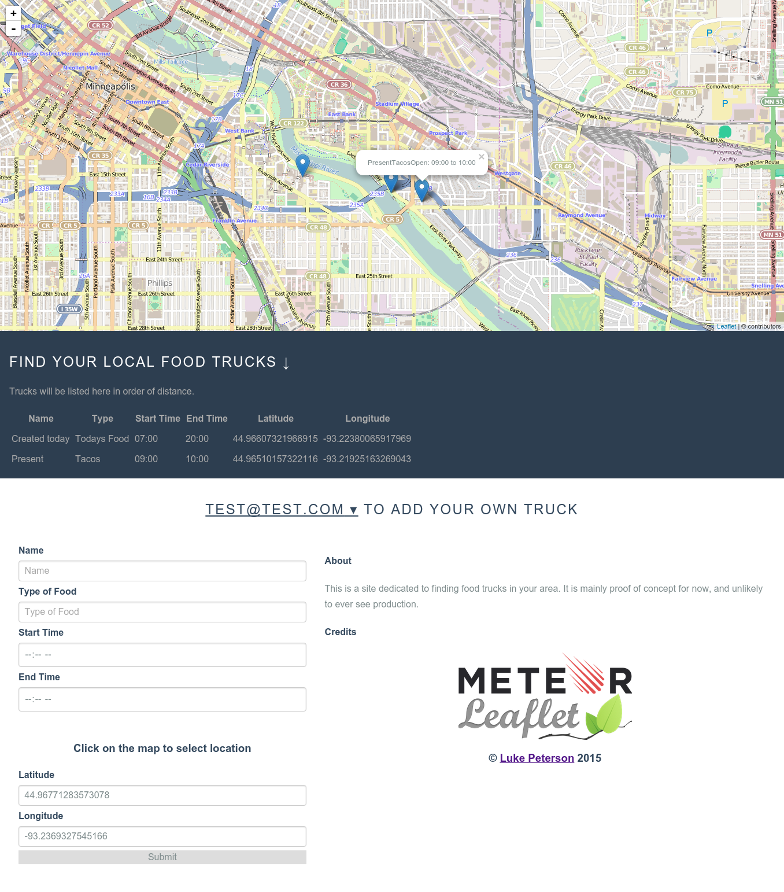
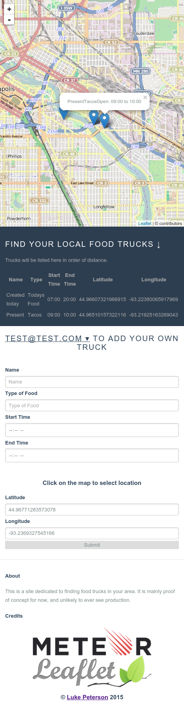

# food-trucks
A website I am making to locate local food trucks. This is a project of mine to learn Meteor framework and become more familiar with LeafletJS. It supports making accounts to add locations and hopefully more robust account features in the future. The website uses PureCSS for layout and works on both mobile and desktop well.
## Desktop View

## Mobile View

